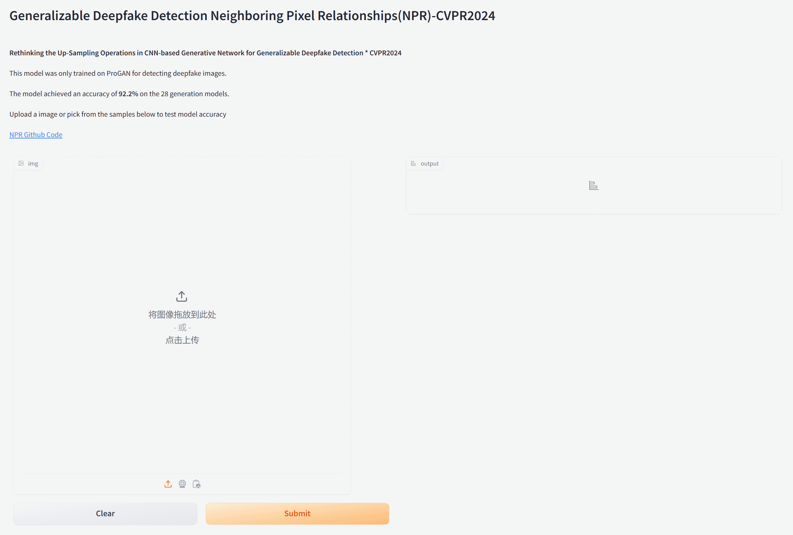

# Rethinking the Up-Sampling Operations in CNN-based Generative Network for Generalizable Deepfake Detection

<p align="center">
	<br>
	Beijing Jiaotong University, YanShan University, A*Star
</p>


Reference github repository for the paper [Rethinking the Up-Sampling Operations in CNN-based Generative Network for Generalizable Deepfake Detection](https://arxiv.org/abs/2312.10461).
```
@misc{tan2023rethinking,
      title={Rethinking the Up-Sampling Operations in CNN-based Generative Network for Generalizable Deepfake Detection}, 
      author={Chuangchuang Tan and Huan Liu and Yao Zhao and Shikui Wei and Guanghua Gu and Ping Liu and Yunchao Wei},
      year={2023},
      eprint={2312.10461},
      archivePrefix={arXiv},
      primaryClass={cs.CV}
}
```

## News 🆕
- `2024/02`: NPR is accepted by CVPR 2024! Congratulations and thanks to my all co-authors!
- `2024/05`: [🤗Online Demo](https://huggingface.co/spaces/tancc/Generalizable_Deepfake_Detection-NPR-CVPR2024)

<a href="https://huggingface.co/spaces/tancc/Generalizable_Deepfake_Detection-NPR-CVPR2024"></a>

## Environment setup
**Classification environment:** 
We recommend installing the required packages by running the command:
```sh
pip install -r requirements.txt
```
In order to ensure the reproducibility of the results, we provide the following suggestions：
- Docker image: nvcr.io/nvidia/tensorflow:21.02-tf1-py3
- Conda environment: [./pytorch18/bin/python](https://drive.google.com/file/d/16MK7KnPebBZx5yeN6jqJ49k7VWbEYQPr/view) 
- Random seed during testing period: [Random seed](https://github.com/chuangchuangtan/NPR-DeepfakeDetection/blob/b4e1bfa59ec58542ab5b1e78a3b75b54df67f3b8/test.py#L14)

## Getting the data
<!-- 
Download dataset from [CNNDetection CVPR2020 (Table1 results)](https://github.com/peterwang512/CNNDetection), [GANGen-Detection (Table2 results)](https://github.com/chuangchuangtan/GANGen-Detection) ([googledrive](https://drive.google.com/drive/folders/11E0Knf9J1qlv2UuTnJSOFUjIIi90czSj?usp=sharing)), [UniversalFakeDetect CVPR2023](https://github.com/Yuheng-Li/UniversalFakeDetect) ([googledrive](https://drive.google.com/drive/folders/1nkCXClC7kFM01_fqmLrVNtnOYEFPtWO-?usp=drive_link)), [DIRE 2023ICCV](https://github.com/ZhendongWang6/DIRE) ([googledrive](https://drive.google.com/drive/folders/1jZE4hg6SxRvKaPYO_yyMeJN_DOcqGMEf?usp=sharing)), Diffusion1kStep [googledrive](https://drive.google.com/drive/folders/14f0vApTLiukiPvIHukHDzLujrvJpDpRq?usp=sharing).
-->
|                        | paper  | Url  |
|:----------------------:|:-----:|:-----:|
| Train set              | [CNNDetection CVPR2020](https://github.com/PeterWang512/CNNDetection)                   | [googledrive](https://drive.google.com/file/d/1iVNBV0glknyTYGA9bCxT_d0CVTOgGcKh/view)                 | 
| Val   set              | [CNNDetection CVPR2020](https://github.com/PeterWang512/CNNDetection)                   | [googledrive](https://drive.google.com/file/d/1FU7xF8Wl_F8b0tgL0529qg2nZ_RpdVNL/view)                 | 
| Table1 Test            | [CNNDetection CVPR2020](https://github.com/PeterWang512/CNNDetection)                   | [googledrive](https://drive.google.com/file/d/1z_fD3UKgWQyOTZIBbYSaQ-hz4AzUrLC1/view)                 | 
| Table2 Test            | [FreqNet AAAI2024](https://github.com/chuangchuangtan/FreqNet-DeepfakeDetection)        | [googledrive](https://drive.google.com/drive/folders/11E0Knf9J1qlv2UuTnJSOFUjIIi90czSj?usp=sharing)   | 
| Table3 Test            | [DIRE ICCV2023](https://github.com/ZhendongWang6/DIRE)                                  | [googledrive](https://drive.google.com/drive/folders/1jZE4hg6SxRvKaPYO_yyMeJN_DOcqGMEf?usp=sharing)   | 
| Table4 Test            | [UniversalFakeDetect CVPR2023](https://github.com/Yuheng-Li/UniversalFakeDetect)        | [googledrive](https://drive.google.com/drive/folders/1nkCXClC7kFM01_fqmLrVNtnOYEFPtWO-?usp=sharing)| 
| Table5 Test            | Diffusion1kStep                                                                         | [googledrive](https://drive.google.com/drive/folders/14f0vApTLiukiPvIHukHDzLujrvJpDpRq?usp=sharing)   | 

```
pip install gdown==4.7.1

chmod 777 ./download_dataset.sh

./download_dataset.sh
```
## Directory structure
<details>
<summary> Click to expand the folder tree structure. </summary>

```
datasets
|-- ForenSynths_train_val
|   |-- train
|   |   |-- car
|   |   |-- cat
|   |   |-- chair
|   |   `-- horse
|   `-- val
|   |   |-- car
|   |   |-- cat
|   |   |-- chair
|   |   `-- horse
|   |-- test
|       |-- biggan
|       |-- cyclegan
|       |-- deepfake
|       |-- gaugan
|       |-- progan
|       |-- stargan
|       |-- stylegan
|       `-- stylegan2
`-- Generalization_Test
    |-- ForenSynths_test       # Table1
    |   |-- biggan
    |   |-- cyclegan
    |   |-- deepfake
    |   |-- gaugan
    |   |-- progan
    |   |-- stargan
    |   |-- stylegan
    |   `-- stylegan2
    |-- GANGen-Detection     # Table2
    |   |-- AttGAN
    |   |-- BEGAN
    |   |-- CramerGAN
    |   |-- InfoMaxGAN
    |   |-- MMDGAN
    |   |-- RelGAN
    |   |-- S3GAN
    |   |-- SNGAN
    |   `-- STGAN
    |-- DiffusionForensics  # Table3
    |   |-- adm
    |   |-- ddpm
    |   |-- iddpm
    |   |-- ldm
    |   |-- pndm
    |   |-- sdv1_new
    |   |-- sdv2
    |   `-- vqdiffusion
    `-- UniversalFakeDetect # Table4
    |   |-- dalle
    |   |-- glide_100_10
    |   |-- glide_100_27
    |   |-- glide_50_27
    |   |-- guided          # Also known as ADM.
    |   |-- ldm_100
    |   |-- ldm_200
    |   `-- ldm_200_cfg
    |-- Diffusion1kStep     # Table5
        |-- DALLE
        |-- ddpm
        |-- guided-diffusion    # Also known as ADM.
        |-- improved-diffusion  # Also known as IDDPM.
        `-- midjourney


```
</details>

## Training the model 
```sh
CUDA_VISIBLE_DEVICES=0 ./pytorch18/bin/python train.py --name 4class-resnet-car-cat-chair-horse --dataroot ./datasets/ForenSynths_train_val --classes car,cat,chair,horse --batch_size 32 --delr_freq 10 --lr 0.0002 --niter 50
```

## Testing the detector
Modify the dataroot in test.py.
```sh
CUDA_VISIBLE_DEVICES=0 ./pytorch18/bin/python test.py --model_path ./NPR.pth  --batch_size {BS}
```

## Detection Results

### [AIGCDetectBenchmark](https://drive.google.com/drive/folders/1p4ewuAo7d5LbNJ4cKyh10Xl9Fg2yoFOw) using [ProGAN-4class checkpoint](https://github.com/chuangchuangtan/NPR-DeepfakeDetection/blob/main/model_epoch_last_3090.pth)

| Generator   |  CNNSpot | FreDect |   Fusing  | GramNet |   LNP   |  LGrad  |  DIRE-G | DIRE-D |  UnivFD |  RPTCon | NPR  |
|  :---------:| :-----:  |:-------:| :--------:|:-------:|:-------:|:-------:|:-------:|:------:|:-------:|:-------:|:----:|
| ProGAN      |  100.00  |  99.36  |   100.00  |  99.99  |  99.67  |  99.83  |  95.19  |  52.75 |  99.81  |  100.00 | 99.9 |
| StyleGan    |  90.17   |  78.02  |   85.20   |  87.05  |  91.75  |  91.08  |  83.03  |  51.31 |  84.93  |  92.77  | 96.1 |
| BigGAN      |  71.17   |  81.97  |   77.40   |  67.33  |  77.75  |  85.62  |  70.12  |  49.70 |  95.08  |  95.80  | 87.3 |
| CycleGAN    |  87.62   |  78.77  |   87.00   |  86.07  |  84.10  |  86.94  |  74.19  |  49.58 |  98.33  |  70.17  | 90.3 |
| StarGAN     |  94.60   |  94.62  |   97.00   |  95.05  |  99.92  |  99.27  |  95.47  |  46.72 |  95.75  |  99.97  | 85.4 |
| GauGAN      |  81.42   |  80.57  |   77.00   |  69.35  |  75.39  |  78.46  |  67.79  |  51.23 |  99.47  |  71.58  | 98.1 |
| Stylegan2   |  86.91   |  66.19  |   83.30   |  87.28  |  94.64  |  85.32  |  75.31  |  51.72 |  74.96  |  89.55  | 98.1 |
| WFIR        |  91.65   |  50.75  |   66.80   |  86.80  |  70.85  |  55.70  |  58.05  |  53.30 |  86.90  |  85.80  | 60.7 |
| ADM         |  60.39   |  63.42  |   49.00   |  58.61  |  84.73  |  67.15  |  75.78  |  98.25 |  66.87  |  82.17  | 84.9 |
| Glide       |  58.07   |  54.13  |   57.20   |  54.50  |  80.52  |  66.11  |  71.75  |  92.42 |  62.46  |  83.79  | 96.7 |
| Midjourney  |  51.39   |  45.87  |   52.20   |  50.02  |  65.55  |  65.35  |  58.01  |  89.45 |  56.13  |  90.12  | 92.6 |
| SDv1.4      |  50.57   |  38.79  |   51.00   |  51.70  |  85.55  |  63.02  |  49.74  |  91.24 |  63.66  |  95.38  | 97.4 |
| SDv1.5      |  50.53   |  39.21  |   51.40   |  52.16  |  85.67  |  63.67  |  49.83  |  91.63 |  63.49  |  95.30  | 97.5 |
| VQDM        |  56.46   |  77.80  |   55.10   |  52.86  |  74.46  |  72.99  |  53.68  |  91.90 |  85.31  |  88.91  | 90.1 |
| Wukong      |  51.03   |  40.30  |   51.70   |  50.76  |  82.06  |  59.55  |  54.46  |  90.90 |  70.93  |  91.07  | 91.7 |
| DALLE2      |  50.45   |  34.70  |   52.80   |  49.25  |  88.75  |  65.45  |  66.48  |  92.45 |  50.75  |  96.60  | 99.6 |
| Average     |  70.78   |  64.03  |   68.38   |  68.67  |  83.84  |  75.34  |  68.68  |  71.53 |  78.43  |  89.31  | **91.7** |

### [GenImage](https://github.com/GenImage-Dataset/GenImage)

<details>
<summary> (1) Change "resize" to "translate and duplicate". (2) Set random seed to 70. (3) During testing, set no_crop to False. </summary>

(1)
```
dset = datasets.ImageFolder(
    root,
    transforms.Compose([
        # rz_func,
	transforms.Lambda(lambda img: translate_duplicate(img, opt.cropSize)),
	crop_func,
	flip_func,
	transforms.ToTensor(),
	transforms.Normalize(mean=[0.485, 0.456, 0.406], std=[0.229, 0.224, 0.225]),
    ]))

import math
def translate_duplicate(img, cropSize):
    if min(img.size) < cropSize:
        width, height = img.size
        
        new_width = width * math.ceil(cropSize/width)
        new_height = height * math.ceil(cropSize/height)
        
        new_img = Image.new('RGB', (new_width, new_height))
        for i in range(0, new_width, width):
            for j in range(0, new_height, height):
                new_img.paste(img, (i, j))
        return new_img
    else:
        return img
```
(2)
Set [random seed](https://github.com/chuangchuangtan/NPR-DeepfakeDetection/blob/bed4c2c9eb9b2000e9a24233d3b010afa3452f12/train.py#L48) to 70.

(3)
During testing, set [no_crop](https://github.com/chuangchuangtan/NPR-DeepfakeDetection/blob/bed4c2c9eb9b2000e9a24233d3b010afa3452f12/train.py#L69) to False. And set [test config](https://github.com/chuangchuangtan/NPR-DeepfakeDetection/blob/bed4c2c9eb9b2000e9a24233d3b010afa3452f12/train.py#L30)
```
vals =       ['ADM', 'biggan', 'glide', 'midjourney', 'sdv5', 'vqdm', 'wukong']
multiclass = [ 0,     0,        0,       0,            0,      0,      0      ]
```
</details>

```
./pytorch18/bin/python  train.py --dataroot {GenImage Path} --name sdv4_bs32_ --batch_size 32 --lr 0.0002 --niter 1  --cropSize 224 --classes sdv4 
```

Train with sdv4 as the training set, using a random seed of 70.

|Generator   | Acc. | A.P. |
|:----------:|:----:|:----:|
| ADM        | 87.8 | 96.0 |
| biggan     | 80.7 | 89.8 |
| glide      | 93.2 | 99.1 |
| midjourney | 91.7 | 97.9 |
| sdv5       | 94.4 | 99.9 |
| vqdm       | 88.7 | 96.1 |
| wukong     | 94.0 | 99.7 |
| Mean       | 90.1 | 96.9 |

<!--
| <font size=2>Method</font>|<font size=2>ProGAN</font> |       |<font size=2>StyleGAN</font>|     |<font size=2>StyleGAN2</font>|    |<font size=2>BigGAN</font>|       |<font size=2>CycleGAN</font> |      |<font size=2>StarGAN</font>|       |<font size=2>GauGAN</font> |       |<font size=2>Deepfake</font>|    | <font size=2>Mean</font> |      |
|:----------------------:|:-----:|:-----:|:------:|:---:|:-------:|:--:|:----:|:-----:|:-------:|:----:|:----: |:-----:|:---:  |:-----:|:----:|:----:|:----:|:----:|
|                        | Acc.  | A.P.  | Acc.   | A.P.| Acc.  | A.P. | Acc.| A.P.   | Acc.    | A.P. | Acc.  | A.P.  | Acc.  | A.P.  | Acc. | A.P. | Acc. | A.P. |
| CNNDetection           | 91.4  | 99.4  | 63.8   | 91.4| 76.4  | 97.5 | 52.9| 73.3   | 72.7    | 88.6 | 63.8  | 90.8  | 63.9  | 92.2  | 51.7 | 62.3 | 67.1 | 86.9 |
| Frank                  | 90.3  | 85.2  | 74.5   | 72.0| 73.1  | 71.4 | 88.7| 86.0   | 75.5    | 71.2 | 99.5  | 99.5  | 69.2  | 77.4  | 60.7 | 49.1 | 78.9 | 76.5 |
| Durall                 | 81.1  | 74.4  | 54.4   | 52.6| 66.8  | 62.0 | 60.1| 56.3   | 69.0    | 64.0 | 98.1  | 98.1  | 61.9  | 57.4  | 50.2 | 50.0 | 67.7 | 64.4 |
| Patchfor               | 97.8  | 100.0 | 82.6   | 93.1| 83.6  | 98.5 | 64.7| 69.5   | 74.5    | 87.2 | 100.0 | 100.0 | 57.2  | 55.4  | 85.0 | 93.2 | 80.7 | 87.1 |
| F3Net                  | 99.4  | 100.0 | 92.6   | 99.7| 88.0  | 99.8 | 65.3| 69.9   | 76.4    | 84.3 | 100.0 | 100.0 | 58.1  | 56.7  | 63.5 | 78.8 | 80.4 | 86.2 |
| SelfBland              | 58.8  | 65.2  | 50.1   | 47.7| 48.6  | 47.4 | 51.1| 51.9   | 59.2    | 65.3 | 74.5  | 89.2  | 59.2  | 65.5  | 93.8 | 99.3 | 61.9 | 66.4 |
| GANDetection           | 82.7  | 95.1  | 74.4   | 92.9| 69.9  | 87.9 | 76.3| 89.9   | 85.2    | 95.5 | 68.8  | 99.7  | 61.4  | 75.8  | 60.0 | 83.9 | 72.3 | 90.1 |
| BiHPF                  | 90.7  | 86.2  | 76.9   | 75.1| 76.2  | 74.7 | 84.9| 81.7   | 81.9    | 78.9 | 94.4  | 94.4  | 69.5  | 78.1  | 54.4 | 54.6 | 78.6 | 77.9 |
| FrePGAN                | 99.0  | 99.9  | 80.7   | 89.6| 84.1  | 98.6 | 69.2| 71.1   | 71.1    | 74.4 | 99.9  | 100.0 | 60.3  | 71.7  | 70.9 | 91.9 | 79.4 | 87.2 |
| LGrad                  | 99.9  | 100.0 | 94.8   | 99.9| 96.0  | 99.9 | 82.9| 90.7   | 85.3    | 94.0 | 99.6  | 100.0 | 72.4  | 79.3  | 58.0 | 67.9 | 86.1 | 91.5 |
| Ojha                   | 99.7  | 100.0 | 89.0   | 98.7| 83.9  | 98.4 | 90.5| 99.1   | 87.9    | 99.8 | 91.4  | 100.0 | 89.9  | 100.0 | 80.2 | 90.2 | 89.1 | 98.3 |
| NPR(our)               | 99.8  | 100.0 | 96.3   | 99.8| 97.3  | 100.0| 87.5| 94.5   | 95.0    | 99.5 | 99.7  | 100.0 | 86.6  | 88.8  | 77.4 | 86.2 | 92.5 | 96.1 |
-->

## Acknowledgments

This repository borrows partially from the [CNNDetection](https://github.com/peterwang512/CNNDetection).
