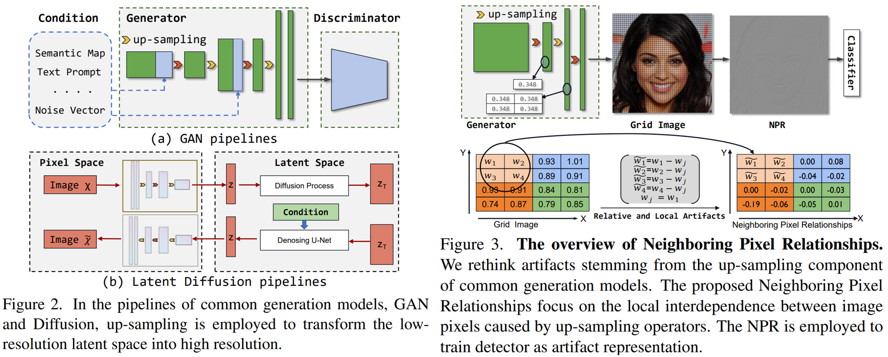

# Rethinking the Up-Sampling Operations in CNN-based Generative Network for Generalizable Deepfake Detection

<p align="center">
	<br>
	Beijing Jiaotong University, YanShan University, A*Star
</p>



Reference github repository for the paper [Rethinking the Up-Sampling Operations in CNN-based Generative Network for Generalizable Deepfake Detection](https://arxiv.org/abs/2312.10461).
```
@misc{tan2023rethinking,
      title={Rethinking the Up-Sampling Operations in CNN-based Generative Network for Generalizable Deepfake Detection}, 
      author={Chuangchuang Tan and Huan Liu and Yao Zhao and Shikui Wei and Guanghua Gu and Ping Liu and Yunchao Wei},
      year={2023},
      eprint={2312.10461},
      archivePrefix={arXiv},
      primaryClass={cs.CV}
}
```

## News 🆕
- `2024/02`: NPR is accepted by CVPR 2024! Congratulations and thanks to my all co-authors!


## Environment setup
**Classification environment:** 
We recommend installing the required packages by running the command:
```sh
pip install -r requirements.txt
```

## Getting the data
Download dataset from [CNNDetection CVPR2020](https://github.com/peterwang512/CNNDetection), [UniversalFakeDetect CVPR2023](https://github.com/Yuheng-Li/UniversalFakeDetect),[DIRE 2023CVPR](https://github.com/ZhendongWang6/DIRE), [GANGen-Detection](https://github.com/chuangchuangtan/GANGen-Detection).

## Training the model 
```sh
CUDA_VISIBLE_DEVICES=0 python train.py --name 4class-resnet-car-cat-chair-horse --dataroot {CNNDetection-Path} --classes car,cat,chair,horse --batch_size 32 --delr_freq 10 --lr 0.0002 --niter 50
```

## Testing the detector
Modify the dataroot in test.py.
```sh
CUDA_VISIBLE_DEVICES=0 python test.py --model_path ./NPR.pth  -batch_size {BS}
```
<!-- 
## Detection Results

| <font size=2>Method</font>|<font size=2>ProGAN</font> |       |<font size=2>StyleGAN</font>|     |<font size=2>StyleGAN2</font>|    |<font size=2>BigGAN</font>|       |<font size=2>CycleGAN</font> |      |<font size=2>StarGAN</font>|       |<font size=2>GauGAN</font> |       |<font size=2>Deepfake</font>|    | <font size=2>Mean</font> |      |
|:----------------------:|:-----:|:-----:|:------:|:---:|:-------:|:--:|:----:|:-----:|:-------:|:----:|:----: |:-----:|:---:  |:-----:|:----:|:----:|:----:|:----:|
|                        | Acc.  | A.P.  | Acc.   | A.P.| Acc.  | A.P. | Acc.| A.P.   | Acc.    | A.P. | Acc.  | A.P.  | Acc.  | A.P.  | Acc. | A.P. | Acc. | A.P. |
| CNNDetection           | 91.4  | 99.4  | 63.8   | 91.4| 76.4  | 97.5 | 52.9| 73.3   | 72.7    | 88.6 | 63.8  | 90.8  | 63.9  | 92.2  | 51.7 | 62.3 | 67.1 | 86.9 |
| Frank                  | 90.3  | 85.2  | 74.5   | 72.0| 73.1  | 71.4 | 88.7| 86.0   | 75.5    | 71.2 | 99.5  | 99.5  | 69.2  | 77.4  | 60.7 | 49.1 | 78.9 | 76.5 |
| Durall                 | 81.1  | 74.4  | 54.4   | 52.6| 66.8  | 62.0 | 60.1| 56.3   | 69.0    | 64.0 | 98.1  | 98.1  | 61.9  | 57.4  | 50.2 | 50.0 | 67.7 | 64.4 |
| Patchfor               | 97.8  | 100.0 | 82.6   | 93.1| 83.6  | 98.5 | 64.7| 69.5   | 74.5    | 87.2 | 100.0 | 100.0 | 57.2  | 55.4  | 85.0 | 93.2 | 80.7 | 87.1 |
| F3Net                  | 99.4  | 100.0 | 92.6   | 99.7| 88.0  | 99.8 | 65.3| 69.9   | 76.4    | 84.3 | 100.0 | 100.0 | 58.1  | 56.7  | 63.5 | 78.8 | 80.4 | 86.2 |
| SelfBland              | 58.8  | 65.2  | 50.1   | 47.7| 48.6  | 47.4 | 51.1| 51.9   | 59.2    | 65.3 | 74.5  | 89.2  | 59.2  | 65.5  | 93.8 | 99.3 | 61.9 | 66.4 |
| GANDetection           | 82.7  | 95.1  | 74.4   | 92.9| 69.9  | 87.9 | 76.3| 89.9   | 85.2    | 95.5 | 68.8  | 99.7  | 61.4  | 75.8  | 60.0 | 83.9 | 72.3 | 90.1 |
| BiHPF                  | 90.7  | 86.2  | 76.9   | 75.1| 76.2  | 74.7 | 84.9| 81.7   | 81.9    | 78.9 | 94.4  | 94.4  | 69.5  | 78.1  | 54.4 | 54.6 | 78.6 | 77.9 |
| FrePGAN                | 99.0  | 99.9  | 80.7   | 89.6| 84.1  | 98.6 | 69.2| 71.1   | 71.1    | 74.4 | 99.9  | 100.0 | 60.3  | 71.7  | 70.9 | 91.9 | 79.4 | 87.2 |
| LGrad                  | 99.9  | 100.0 | 94.8   | 99.9| 96.0  | 99.9 | 82.9| 90.7   | 85.3    | 94.0 | 99.6  | 100.0 | 72.4  | 79.3  | 58.0 | 67.9 | 86.1 | 91.5 |
| Ojha                   | 99.7  | 100.0 | 89.0   | 98.7| 83.9  | 98.4 | 90.5| 99.1   | 87.9    | 99.8 | 91.4  | 100.0 | 89.9  | 100.0 | 80.2 | 90.2 | 89.1 | 98.3 |
| NPR(our)               | 99.8  | 100.0 | 96.3   | 99.8| 97.3  | 100.0| 87.5| 94.5   | 95.0    | 99.5 | 99.7  | 100.0 | 86.6  | 88.8  | 77.4 | 86.2 | 92.5 | 96.1 |
-->

## Acknowledgments

This repository borrows partially from the [CNNDetection](https://github.com/peterwang512/CNNDetection).
